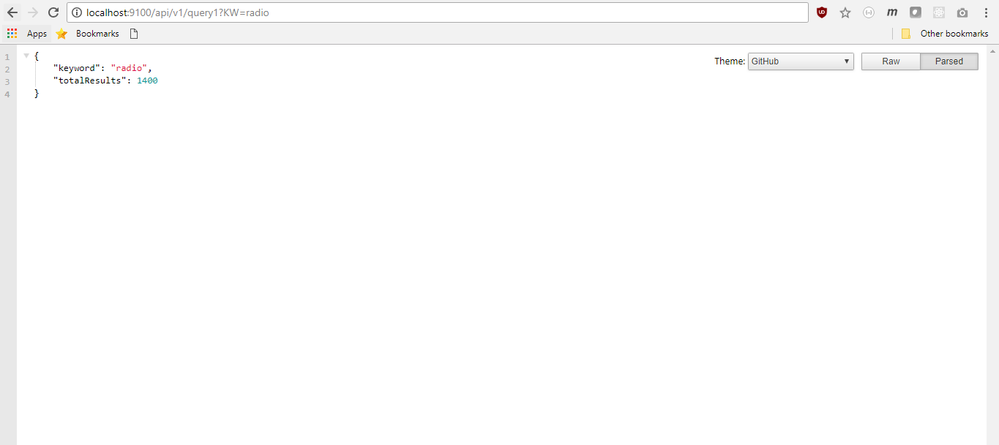
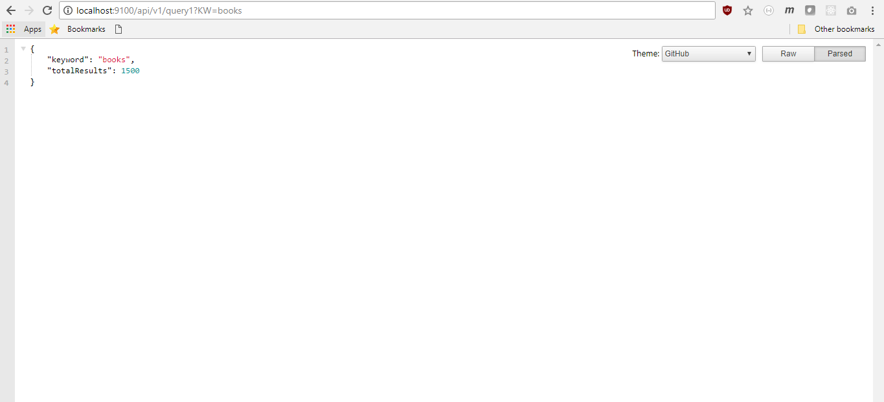
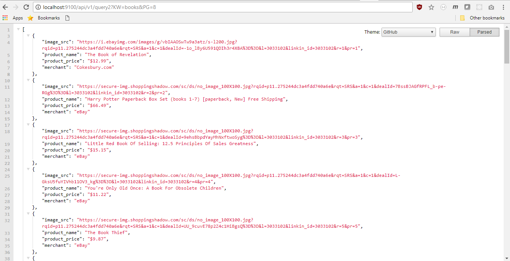
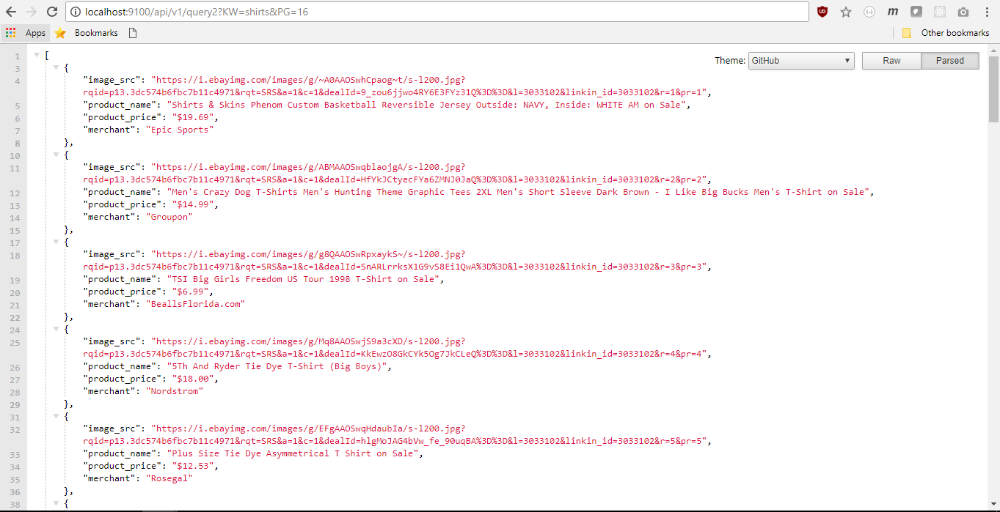

# LOKTRA
This is an assignment.

# Installation
### Windows
```sh
$ git clone https://github.com/stillNovice/Loktra.git
$ cd Loktra
$ npm install
$ cd config/
$ update config.js with relevant parameters (url of the MongoDB server and the Database name)
$ cd ..
$ npm start

```

### Linux
```sh
$ git clone https://github.com/stillNovice/Loktra.git
$ cd Loktra
$ npm install
$ cd config/
$ update config.js with relevant parameters (url of the MongoDB server and the Database name)
$ cd ..
$ sudo npm install -g babel-cli
$ node src/app.js

```

# Usage & Specifications.
1. Open Chrome
2. Go to localhost:9100
3. This solution exposes two API's. Please respect the parameters and the structure of the API's to get the optimal results.
  - ``` /api/v1/query1?KW=<keyword> ``` : This API gives back a JSON response that has two fields, namely **"keyword"** and **"totalResults"** specifying the keyword on which the search and scrape happened and the total search results respectively.

  - ``` /api/v1/query2?KW=<keyword>&PG=<pageNumber>``` : This API gives back an array of JSON response, where each JSON element represents a search result of the search text **"keyword**. Each JSON has four fields namely **"image_src"**, **"product_name"**, **"product_price"** and **"merchant"** specifying the image URL of the product, name of the product, price of the product and the merchant that is selling the product respectively.
4. This solution also used **MongoDB** as the **database** to store the results of big API calls. Just specify the URL of the MongoDB server and the Database name in ./config/config.js file and you'll be good to go. The solution scrapes everytime for a new **keyword** and store the total search results in the database so that the next time the same keyword appears as search parameter, a single database query can come in handy.

# Screenshots
  ## API 1 - /api/v1/query1/KW=radio
  

  ## API 1 - /api/v1/query1/KW=books
  

  ## API 1 - /api/v1/query2/PG=8&KW=books
  

  ## API 1 - /api/v1/query1/KW=shirts
  

  ## API 1 - /api/v1/query2/KW=shirts&PG=16
  
    